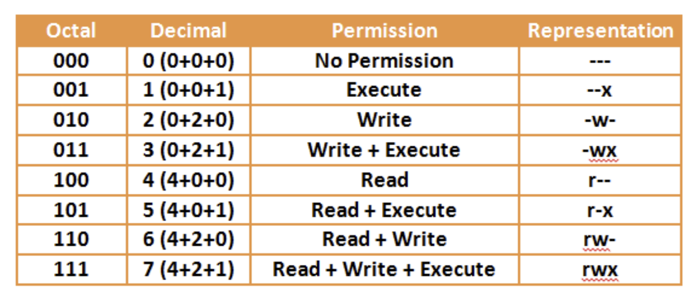
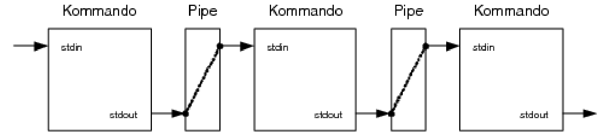

# Bash Commands

## Help

```bash
<command> --help
```
Get command help

---

```bash
man <command>
```
Get man page of command

type: `/<search term>` to search  
=> type: `n` go to next match  
=> type: `N` go to prev match  

## Basics

```bash
who
```
Show all logged in users

---

```bash
whoami
```
Show my username

---

```bash
ls -la
```
list all files and folders - also hidden (a)

---

```
-rwxrwx--x  1 vmadmin vmadmin  460 Aug  5  2018 verzweigung7.sh
```
rwxrwx--x = 

| rwx  | rwx   | --x    |
| ---- | ----- | ------ |
| User | Group | Others |

```bash
chmod 777 file.txt
```
set permission for file.txt



---

```bash
sudo nautilus
```
gnu file manager as root

---

```bash
pwd
```
Get current directory

---

```bash
find / -name "*usb*.conf" 2>/dev/null
```
find from root any file matching  
suppress all stderr

---

```bash
cut -d ' ' -f 2,4 blumenartikel.txt
```
get column 2 & 4 (`-f`) from file using delimiter (space) (`-d`)

---

```bash
sort -n -k 2 tmp.out
```
Sort the 2nd col (`-k`) ASC using number (`-n`) from file tmp.out

---

```bash
ln -s /home/vmadmin/M122
ln -s /home/vmadmin/M122 /home/vmadmin/Desktop/M122_Alias # with target specified (M122_Alias)
```
Create symbolic link

---

```bash
ls -la | tee dir.txt # shows console output
ls -la >dir.txt # won't show console output
```
Show stdout in console and write to file

---

```bash
which ifconfig # out: /usr/sbin/ifconfig
```
Show path of executable

## Vars

```bash
HELLO="World"
echo $HELLO
```

- `$PATH` _Locations containing executables_
- `$?`  _Exit status of last command / script_

## Parameters

```bash
./script.sh hello world
```
- `$0` = `./script.sh` - script path
- `$@` = `hello world` - array of all arguments
- `$1` = `hello`
- `$2` = `world`
- ...
- `$#` = `2` - number of arguments

## Pipe |



```bash
cat outputblumen.txt | more -1
```
Get content of file and pass to more to show only 1 line

## Pre exec $()

```bash
chmod 777 $(find /home/vmadmin/ -name *.txt)
```
Change permission for every file in /home/vmadmin with filetype `.txt`

## Write to file

```bash
<command> 2>/dev/null               # hide all stderr in console

# into file:
<command> >no_errors.txt            # stdout
<command> 2>errors.txt              # stderr
<command> &>out_and_errors.txt      # stdout & stderr

<command> >stdout.txt 2>stderr.txt  # stdout & stderr - separate file
```

## Read input

```bash
read -p "Enter smth: " # limit number of chars using `-N <int: chars>`
echo $USER_INPUT
```

## if

```bash
if [[ $1 -eq 'hello'  &&  $1 =~ ^[Hh].*[^\.]$ ]] # see Comparer below
then
    echo 'world'
else
    echo 'else'
fi

# using function and return code
function my_func {
    true
}
function my_func_false {
    false
}

if $(my_func) && [[ 12 =~ [0-9]+ ]] # func and regex combined
then
    echo "true"
fi

if ! $(my_func_false)
then
    echo "false"
fi
```

| Comparer                    | Explanation                                                           |
| --------------------------- | --------------------------------------------------------------------- |
| `! <EXPRESSION>`            | The EXPRESSION is false.                                              |
| `-n <STRING>`               | The length of STRING is greater than zero.                            |
| `-z <STRING>`               | The lengh of STRING is zero (ie it is empty).                         |
| `<STRING1> = <STRING2>`     | STRING1 is equal to STRING2                                           |
| `<STRING1> != <STRING2>`    | STRING1 is not equal to STRING2                                       |
| `<STRING> =~ <EXPRESSION>`  | STRING matches expression `=> expression without quotes`              |
| `<INTEGER1> -eq <INTEGER2>` | INTEGER1 is numerically equal to INTEGER2                             |
| `<INTEGER1> -gt <INTEGER2>` | INTEGER1 is numerically greater than INTEGER2                         |
| `<INTEGER1> -lt <INTEGER2>` | INTEGER1 is numerically less than INTEGER2                            |
| `-d <FILE>`                 | FILE exists and is a directory.                                       |
| `-e <FILE>`                 | FILE exists.                                                          |
| `-r <FILE>`                 | FILE exists and the read permission is granted.                       |
| `-s <FILE>`                 | FILE exists and it's size is greater than zero (ie. it is not empty). |
| `-w <FILE>`                 | FILE exists and the write permission is granted.                      |
| `-x <FILE>`                 | FILE exists and the execute permission is granted.                    |

## switch case

```bash
echo -n "Enter the name of a country: "
read COUNTRY

case $COUNTRY in
  "Switzerland") # string
    echo -n "Schweiz"
    ;;

  [0-9]) # using regex
    echo -n "any Number"
    ;;

  *)
    echo -n "unknown"
    ;;
esac
```

## while

```bash
exit=0

while [ $exit -ne 1 ]
do

  i=0
  while [ $i -lt 10 ]
  do
    echo "."
    sleep 1
    ((i++))
  done
  
  $exit=1
done
```

## for

```bash
for i in {0..3} # for item in [LIST]
do
  echo "Number: $i"
done

# declaring array:
BOOKS=('In Search of Lost Time' 'Don Quixote' 'Ulysses' 'The Great Gatsby')
for book in "${BOOKS[@]}"; do
  echo "Book: $book"
done

# using i:
for ((i = 0 ; i <= 1000 ; i++)); do
  echo "Counter: $i"
done

# using files:
for file in /home/vmadmin/Desktop/M122; do
    echo $file
done
```

## functions

```bash
function hello_world {
  echo "hello world"
}

globalVar="change me"

hello_user () {
  # param: $1 - firstname
  # param: $2 - lastname
  local localVar=10
  globalVar="changed"

  echo "hello $1 $2"

  return 0 # only numeric - else use global vars
}

# call function -> without `()`
hello_world
hello_user "john" "doe"
# access return value
echo $?
```

Access to parameters is the same as for whole scripts.  
:arrow_right: [Parameters](#parameters)

## Command Master Table

| Command     | Purpose                                                         |
| ----------- | --------------------------------------------------------------- |
| `basename ` | strip directory and suffix from filenames                       |
| `cat      ` | concatenate files and print on the standard output              |
| `cd       ` | change directory                                                |
| `chgrp    ` | change file group ownership                                     |
| `chmod    ` | change file permissions                                         |
| `chown    ` | change file owner and group                                     |
| `cp       ` | copy files and directories                                      |
| `cut      ` | remove sections from each line of files                         |
| `date     ` | print or set the system date and time                           |
| `dc       ` | an arbitrary precision calculator                               |
| `echo     ` | display a line of text                                          |
| `exit     ` | terminate script and return exit-code                           |
| `find     ` | search for files in a directory hierarchy                       |
| `gedit    ` | text editor for the GNOME Desktop                               |
| `grep     ` | print lines that match patterns                                 |
| `head     ` | output the first part of files                                  |
| `ifconfig ` | configure a network interface                                   |
| `kill     ` | send a signal to a process                                      |
| `ls       ` | list directory contents                                         |
| `man      ` | an interface to the system reference manuals                    |
| `mkdir    ` | make directories                                                |
| `mv       ` | move (rename) files                                             |
| `nano     ` | Nano's ANOther editor, inspired by Pico                         |
| `nautilus ` | a file manager for GNOME                                        |
| `ps       ` | report a snapshot of the current processes.                     |
| `pwd      ` | print name of current/working directory                         |
| `read     ` | get user input                                                  |
| `rmdir    ` | remove empty directories                                        |
| `rm       ` | remove files or directories                                     |
| `sort     ` | sort lines of text files                                        |
| `sudo     ` | execute a command as another user                               |
| `tail     ` | output the last part of files                                   |
| `tee      ` | read from standard input and write to standard output and files |
| `top      ` | display Linux processes                                         |
| `touch    ` | create file without content                                     |
| `tr       ` | translate or delete characters                                  |
| `wc       ` | print word count for file                                       |
| `which    ` | locate a command                                                |
| `whoami   ` | print effective userid                                          |
| `who      ` | show who is logged on                                           |

Source: `man`

## Regex

> Reference: `122 DossierL.pdf` - Page 59

```bash
# grep '<regex expression>' <file>
grep '1$' mrolympia.dat
```

## Create New Script

```bash
#!/usr/bin/env bash

# Programm: HalloWelt.sh
# Version: 1.0
# Autor: TKluser
# Datum: 08.09.2021
# Lizenz: MIT
# Beschreibung: <TODO>

echo "hello world"
```

First line is called **Shebang**.  
There are two options of defining:

- `#!/bin/bash` direct path to interpreter
- `#!/usr/bin/env bash` get the path to interpreter from env
